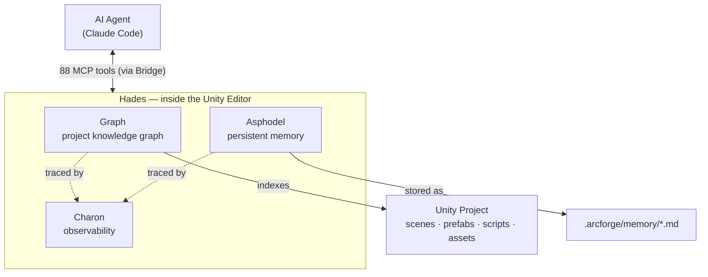

# Hades

[](LICENSE)
[](https://github.com/TheArcForge/Hades/releases)
[](https://github.com/TheArcForge/Hades/actions/workflows/ci.yml)
[](https://unity.com)
[](https://nodejs.org)
[](https://modelcontextprotocol.io)

> **In the underworld of your Unity project, nothing is hidden from Hades. And now, nothing is hidden from your AI agent.**

Hades is Unity-aware AI infrastructure for Claude Code. It builds a queryable knowledge graph of your entire Unity project — every scene, prefab, script, asset, and dependency — so your AI agent *knows* your project's structure instead of guessing at it. Out of the box you get 88 MCP tools, 22 skills, and 6 commands. Everything runs locally, and everything is version-controllable.

<!-- ===================== HERO DEMO GIF (placeholder) =====================
     TODO: replace Documentation/media/demo-hero.gif with the final side-by-side render.
     Spec: split screen, WITHOUT HADES (left) vs WITH HADES (right), same prompt,
     same model. Live counters: tool calls + cost. End card holds the verdict.
     Do NOT reference time — it is not the story. Story = correctness + cost.
     Also export demo-hero.png (end-card still) for social/OG previews.
====================================================================== -->
<div align="center">


**One prompt — *"which prefabs and scenes break if I change `EnemyAI`?"***
Left: stock Claude Code. Right: with Hades.
→ [see the full side-by-side breakdown](Documentation/comparison.md)

</div>

> Stock Claude Code reads ~200k tokens of YAML, finds **1 prefab, misses 3
> variants, and tells you to add code that breaks them.** Hades answers
> correctly — 4 prefabs, 3 scenes — in **7 tool calls for 27% less cost.**
> That gap is the whole project.

## Know, don't guess

Most AI tools **search and predict**: they grep for text that looks relevant and let the model infer the rest. The answers are probabilistic — and often wrong in ways you can't see.

Hades lets your agent **know and analyze**. When it asks "what references `PlayerController`," it reads a structural fact from the graph, not a guess from scattered snippets. Dependency analysis traces real edges. Ask the same question twice, get the same answer. One graph query replaces a dozen file reads — and the agent never makes you explain your project twice.

## What Hades gives your AI agent

| Layer | What it does |
|-------|-------------|
| **Graph** | A semantic knowledge graph of your Unity project — scenes, prefabs, scripts, assets, and their dependencies. The agent sees your project's structure, not just its files. |
| **Charon** | Full observability — every tool call, graph query, and memory operation is traced. Inspect via the local dashboard (**Hades > Open Charon Dashboard** in Unity). |
| **Asphodel** | Persistent project memory in version-controlled markdown (`.arcforge/memory/`). Capture decisions, patterns, and conventions once; the agent reads them for context-aware advice every session. |
| **22 Skills** | Architecture decisions, workflow guidance, and domain expertise — networking, audio, UI, shaders, ECS, testing, and more. |
| **88 MCP Tools** | 21 graph/charon/memory tools + 67 editor-action tools (scenes, components, prefabs, materials, animation, assets). |
| **6 Commands** | `/hades:status`, `/hades:rebuild-graph`, `/hades:show-traces`, `/hades:validate-memory`, `/hades:show-proposals`, `/hades:export-traces` |

### How the pieces fit together



Your agent talks to Hades through the **88 MCP tools** (carried over the Bridge launcher and hub). Inside the Unity Editor, **Graph** indexes your project's structure, **Asphodel** persists project memory as version-controlled markdown, and **Charon** traces every operation so nothing is hidden.

## How Hades compares

Most AI-for-Unity tooling falls into one of two camps. **Action bridges** let an agent *execute* editor actions but have no model of your project. **Code-graph / RAG tools** understand code but are blind to Unity's asset layer — prefabs, scenes, GUIDs, serialized references. Hades does both, and it's Unity-native.

| | Action-bridge Unity MCPs | Code-graph / RAG tools | **Hades** |
|---|:---:|:---:|:---:|
| Executes Unity editor actions (scenes, prefabs, components) | ✅ | ❌ | ✅ |
| Understands the Unity asset graph (prefabs, scenes, GUIDs, serialized refs) | ❌ | ⚠️ code only | ✅ |
| "What references X?" as a structural fact, not text grep | ❌ | ✅ code | ✅ code **+ assets** |
| Persistent, version-controlled project memory | ❌ | ❌ | ✅ |
| Full observability / tracing of every operation | ❌ | ❌ | ✅ |
| Confidence signals (tells you when *not* to trust a result) | ❌ | ❌ | ✅ |
| Runs entirely locally, no cloud, version-controllable | ⚠️ varies | ⚠️ varies | ✅ |

## See it in action

Open Claude Code from your Unity project directory and ask:

```
Tell me about this project
```
The agent uses the graph to give a project-specific overview — not a generic summary.

```
Where do we use PlayerController?
```
Structural search across scenes, prefabs, and scripts — not just text grep.

```
I want to remove OldNetworkManager. What would break?
```
Dependency analysis that traces references through the full project graph *before* you change anything.

**Want proof?** [**With and without Hades: one prompt, side by side**](Documentation/comparison.md) — the same task run twice under identical conditions. Stock Claude Code misses 3 prefab variants and recommends a change that would break inheritance; Hades returns the correct impact map for 27% less cost. Includes full uncut recordings and reproduction steps.

## What to trust (and what to verify)

Hades is honest about its own certainty — every result carries a confidence signal, and the tools tell you when *not* to rely on them. As a rule of thumb:

| Trust level | What | How to use it |
|---|---|---|
| **Trust** | Structural facts: type → file, prefab/scene/material/ScriptableObject contents, asset GUID/type, direct dependencies | Use directly — these read serialized data straight from your project. |
| **Verify** | "What references X?" for scripts and prefabs | Treat the result as a strong lead. Before concluding "unused / safe to delete," check the `nested_by` field and the confidence block. |
| **Confirm** | Inheritance / `implements` edges, C# dependency traces, "which prefabs use this component" | Confirm independently when the answer involves types from precompiled packages/DLLs, generics, or reflection/DI wiring. |

Hades is a **navigator, not an oracle**: it makes understanding your project fast and structural, and it surfaces its own blind spots so you (and your agent) stay in the loop before anything destructive. See [Interpreting results](Documentation/interpreting-results.md) for what each confidence signal means, and [Limitations](LIMITATIONS.md) for the boundaries that are there by design.

## Prerequisites

- **Unity 6000.0+**
- **Node.js 20+**
- **Claude Code** (or any MCP-compatible agent client)

## Installation

### Step 1: Unity Package

**From git URL:**

In Unity's Package Manager, click **Add package from git URL** and enter:

```
https://github.com/TheArcForge/Hades.git
```

**From local folder (for testing or offline use):**

In Unity's Package Manager, click **Add package from disk...** and select the `package.json` inside your local Hades folder.

> On first open after install, Hades automatically builds the project knowledge graph. This is a **one-time** step (behind a progress bar) — a few seconds on a typical project, up to a few minutes on a very large one. After that, updates are incremental and near-instant.

### Step 2: Claude Code Plugin

**Option A: Persistent install (recommended)**

```
/plugin marketplace add TheArcForge/hades-plugin
/plugin install hades
```

**Option B: Per-session**

```bash
claude --plugin-dir /path/to/hades-plugin
```

That's it. Open Claude Code from your Unity project directory and the tools are available immediately.

> **First time?** See the full [Getting Started](Documentation/getting-started.md) guide for a step-by-step walkthrough with verification at each step.

## How it works

Claude Code connects over stdio to a lightweight launcher, which routes HTTP requests to the Hades Hub, which in turn forwards tool calls to the correct Unity Editor instance. The Hub runs once per machine and handles multi-project routing automatically. All data stays local — no cloud services, no telemetry, no vendor lock-in. See [`Documentation/arcforge-hades-architecture.md`](Documentation/arcforge-hades-architecture.md) for full architectural details.

## Troubleshooting

| Symptom | Fix |
|---------|-----|
| No tools appear in Claude Code | Is Unity running? Check `~/.arcforge/hades-hub/hub.json` for a registered instance. |
| Tools disappear after recompile | Wait ~10 seconds — the Hub buffers tool calls during Unity's domain reload. |
| Wrong project receives tool calls | Launch Claude Code from the correct project directory. |
| Project info seems stale | Run `/hades:rebuild-graph` to regenerate the knowledge graph. |

See [`Documentation/troubleshooting.md`](Documentation/troubleshooting.md) for the full troubleshooting guide.

## Project status

Hades is **v1** — field-tested on a large production Unity project, but young. Static analysis has known boundaries (see [Limitations](LIMITATIONS.md)), and it hasn't yet been exercised across many projects, Unity versions, or platforms. That's where you come in: if a result looks wrong on *your* project, please [open an issue](https://github.com/TheArcForge/Hades/issues) — concrete repros on real projects are exactly how v1 gets solid. The tools are built to tell you when they're uncertain, so trust the confidence signals and verify before anything destructive.

## Documentation

- [Interpreting results](Documentation/interpreting-results.md) — what each confidence signal means and how to act on it
- [Limitations](LIMITATIONS.md) — the boundaries that are there by design
- [Architecture](Documentation/arcforge-hades-architecture.md) — system design, data flow, component responsibilities
- [Plugin Manifest](Documentation/arcforge-hades-plugin.md) — tool and skill reference
- [Roadmap](Documentation/arcforge-hades-roadmap.md) — development phases and status
- [Vision](Documentation/arcforge-hades-vision.md) — long-term goals and design philosophy

## License

MIT
