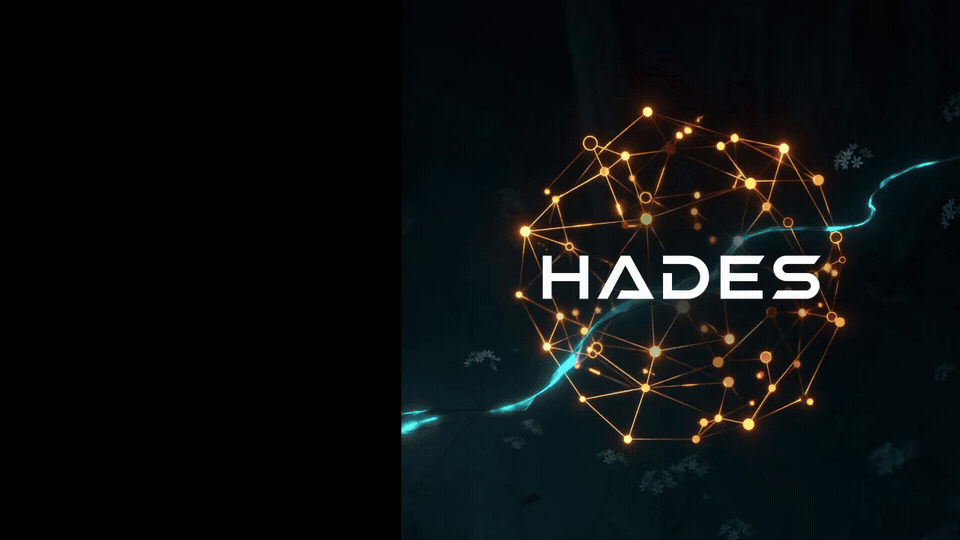
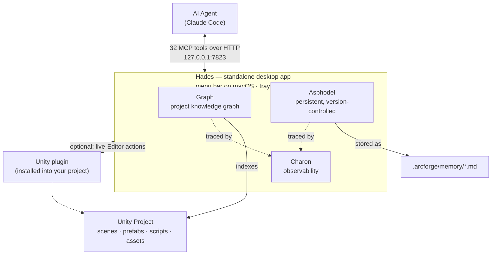

# Hades

[](LICENSE)
[](https://github.com/TheArcForge/Hades/releases)
[](https://github.com/TheArcForge/Hades/actions/workflows/ci.yml)
[](https://www.apple.com/macos/)
[](#prerequisites)
[](https://unity.com)
[](https://modelcontextprotocol.io)

> **In the underworld of your Unity project, nothing is hidden from Hades. And now, nothing is hidden from your AI agent.**



Hades is Unity-aware AI infrastructure for Claude Code. It's a **standalone desktop app** — a menu-bar app on macOS, a tray app on Windows (**beta**) — that builds a queryable knowledge graph of your entire Unity project — every scene, prefab, script, asset, and dependency — so your AI agent *knows* your project's structure instead of guessing at it. Out of the box you get 32 MCP tools, 22 skills, and 6 commands. Everything runs locally, and everything is version-controllable.

<!-- ===================== HERO DEMO GIF (placeholder) =====================
     TODO: render Documentation/media/demo-hero.gif as the final side-by-side.
     Spec: split screen, WITHOUT HADES (left) vs WITH HADES (right), same prompt,
     same model. Live counters: tool calls + cost. End card holds the verdict.
     Do NOT reference time — it is not the story. Story = correctness + cost.
     Also export demo-hero.png (end-card still) for social/OG previews.
     Not embedded above until it exists — a missing  renders broken on GitHub.
====================================================================== -->

> **One prompt — *"which prefabs and scenes break if I change `EnemyAI`?"***
> Stock Claude Code reads ~200k tokens of YAML, finds **1 prefab, misses 3
> variants, and tells you to add code that breaks them.** Hades answers
> correctly — 4 prefabs, 3 scenes — in **7 tool calls for 27% less cost.**
> That gap is the whole project.
> → [see the full side-by-side breakdown](Documentation/comparison.md)

## Know, don't guess

Most AI tools **search and predict**: they grep for text that looks relevant and let the model infer the rest. The answers are probabilistic — and often wrong in ways you can't see.

Hades lets your agent **know and analyze**. When it asks "what references `PlayerController`," it reads a structural fact from the graph, not a guess from scattered snippets. Dependency analysis traces real edges. Ask the same question twice, get the same answer. One graph query replaces a dozen file reads — and the agent never makes you explain your project twice.

## What Hades gives your AI agent

| Layer | What it does |
|-------|-------------|
| **Graph** | A semantic knowledge graph of your Unity project — scenes, prefabs, scripts, assets, and their dependencies. The agent sees your project's structure, not just its files. |
| **Charon** | Full observability — every tool call, graph query, and memory operation is traced. Inspect them in the app's **Charon** window. |
| **Asphodel** | Persistent project memory in version-controlled markdown (`.arcforge/memory/`). Capture decisions, patterns, and conventions once; the agent reads them for context-aware advice every session. |
| **22 Skills** | Architecture decisions, workflow guidance, and domain expertise — networking, audio, UI, shaders, ECS, testing, and more. |
| **32 MCP Tools** | Graph queries, dependency tracing, inspection, project memory, observability, and editor actions (scenes, prefabs, components, materials, animation, assets). |
| **6 Commands** | `/hades:status`, `/hades:rebuild-graph`, `/hades:show-traces`, `/hades:validate-memory`, `/hades:show-proposals`, `/hades:export-traces` |

### How the pieces fit together



Your agent talks to Hades over MCP on `127.0.0.1:7823`. The app indexes your project's structure into the **Graph**, persists project memory as **Asphodel**, version-controlled markdown, and **Charon** traces every operation so nothing is hidden. Reading your project needs nothing installed in it — the optional Unity plugin is only for **live-Editor** actions (editing scenes and prefabs, running tests, reading the console), and it dials out to the app rather than the app reaching in.

## How Hades compares

Most AI-for-Unity tooling falls into one of two camps. **Action bridges** let an agent *execute* editor actions but have no model of your project. **Code-graph / RAG tools** understand code but are blind to Unity's asset layer — prefabs, scenes, GUIDs, serialized references. Hades does both, and it's Unity-native.

| | Action-bridge Unity MCPs | Code-graph / RAG tools | **Hades** |
|---|:---:|:---:|:---:|
| Executes Unity editor actions (scenes, prefabs, components) | ✅ | ❌ | ✅ |
| Understands the Unity asset graph (prefabs, scenes, GUIDs, serialized refs) | ❌ | ⚠️ code only | ✅ |
| "What references X?" as a structural fact, not text grep | ❌ | ✅ code | ✅ code **+ assets** |
| Persistent, version-controlled project memory | ❌ | ❌ | ✅ |
| Full observability / tracing of every operation | ❌ | ❌ | ✅ |
| Confidence signals (tells you when *not* to trust a result) | ❌ | ❌ | ✅ |
| Runs entirely locally, no cloud, version-controllable | ⚠️ varies | ⚠️ varies | ✅ |

## See it in action

Open Claude Code from your Unity project directory and ask:

```
Tell me about this project
```
The agent uses the graph to give a project-specific overview — not a generic summary.

```
Where do we use PlayerController?
```
Structural search across scenes, prefabs, and scripts — not just text grep.

```
I want to remove OldNetworkManager. What would break?
```
Dependency analysis that traces references through the full project graph *before* you change anything.

**Want proof?** [**With and without Hades: one prompt, side by side**](Documentation/comparison.md) — the same task run twice under identical conditions. Stock Claude Code misses 3 prefab variants and recommends a change that would break inheritance; Hades returns the correct impact map for 27% less cost. Includes full uncut recordings and reproduction steps.

## What to trust (and what to verify)

Hades is honest about its own certainty — every result carries a confidence signal, and the tools tell you when *not* to rely on them. As a rule of thumb:

| Trust level | What | How to use it |
|---|---|---|
| **Trust** | Structural facts: type → file, prefab/scene/material/ScriptableObject contents, asset GUID/type, direct dependencies | Use directly — these read serialized data straight from your project. |
| **Verify** | "What references X?" for scripts and prefabs | Treat the result as a strong lead. Before concluding "unused / safe to delete," check the `nested_by` field and the confidence block. |
| **Confirm** | Inheritance / `implements` edges, C# dependency traces, "which prefabs use this component" | Confirm independently when the answer involves types from precompiled packages/DLLs, generics, or reflection/DI wiring. |

Hades is a **navigator, not an oracle**: it makes understanding your project fast and structural, and it surfaces its own blind spots so you (and your agent) stay in the loop before anything destructive. See [Interpreting results](Documentation/interpreting-results.md) for what each confidence signal means, and [Limitations](LIMITATIONS.md) for the boundaries that are there by design.

## Prerequisites

**macOS**

- **Apple Silicon Mac, macOS 14+** — the embedded core is arm64-only. On an Intel Mac the app shows a clear alert and quits rather than failing silently.

**Windows — beta**

- **Windows 10 version 1607 (build 14393) or later**, 64-bit. The installer checks the build and refuses below it. There is no 32-bit build.
- **x64 or ARM64.** Both are shipped. The **ARM64 build has never been run on ARM64 hardware** — it is built and its binaries verified native, nothing more. If you run it there, an issue report is genuinely useful.
- Windows support is **beta**: it is at feature parity with the Mac and its suites pass, but it has had far less real-world use. See [Limitations](LIMITATIONS.md).

**Both**

- **Claude Code** — other MCP clients are untested.
- **Unity 6000.0+** — only for the optional in-Editor plugin. Reading and querying your project works without it.

## Installation

### Step 1: Install the app

**macOS**

```sh
curl -fsSL https://raw.githubusercontent.com/TheArcForge/Hades/main/install.sh | bash
```

That downloads the release DMG, verifies its SHA-256, and copies `Hades.app` to `/Applications`. It needs no `sudo`, changes no system settings, and disables nothing. If you'd rather read a script before running it — a reasonable habit — the source is [`install.sh`](install.sh):

```sh
curl -fsSL -O https://raw.githubusercontent.com/TheArcForge/Hades/main/install.sh
```

You can also take the DMG from [Releases](https://github.com/TheArcForge/Hades/releases) and drag it to Applications. That works, but macOS will block it on first launch — see [Signing and installation](#signing-and-installation).

**Windows**

```powershell
irm https://raw.githubusercontent.com/TheArcForge/Hades/main/install.ps1 | iex
```

That picks the MSI for your architecture, verifies its SHA-256, and installs **per-user** into `%LOCALAPPDATA%\Programs\Hades`. It needs no Administrator, shows no UAC prompt, and changes no system settings. The source is [`install.ps1`](install.ps1) if you would rather read it first:

```powershell
irm https://raw.githubusercontent.com/TheArcForge/Hades/main/install.ps1 -OutFile install.ps1
```

You can also take the MSI for your architecture from [Releases](https://github.com/TheArcForge/Hades/releases) and run it. That works, but SmartScreen will warn on a browser-downloaded file — see [Signing and installation](#signing-and-installation).

**Then, on either platform**

Launch Hades — it lives in the menu bar on macOS, the notification-area tray on Windows. Add your Unity project when it asks. On first index Hades builds the knowledge graph — a few seconds on a typical project, up to a few minutes on a very large one. After that, updates are incremental.

Windows also installs a `hades` command-line tool onto your PATH. It only appears in terminals you open *after* installing, because Windows hands each process its environment at launch.

### Step 2: Claude Code plugin

```
/plugin marketplace add TheArcForge/hades-plugin
```

then `/plugin install hades`. Run `/mcp` afterwards and confirm `hades` reports **32 tools**.

Working from a clone instead? Point Claude Code at the plugin directly — per-session, so pass it every time:

```sh
claude --plugin-dir <your-Hades-checkout>/ClaudeCodePlugin
```

### Step 3 (optional): Unity plugin

Only needed for live-Editor actions — editing scenes and prefabs, running tests, reading the console. Hades installs it into your project's `Assets/Hades` from the app; you don't add a package or a git URL. Everything else works without it.

### Uninstalling

**macOS**

```sh
curl -fsSL https://raw.githubusercontent.com/TheArcForge/Hades/main/uninstall.sh | bash
```

Removes the app, its data, the macOS sidecars, and the launch-at-login item — which dragging to
Trash leaves behind, pointing at an app that no longer exists. Add `--dry-run` to see exactly what
it would remove first.

**Windows** — **Settings → Apps → Installed apps → Hades → Uninstall**. That removes the app, the
Start Menu shortcut and the PATH entry. Unlike the Mac script it does **not** remove your data: an
MSI that deleted `%LOCALAPPDATA%\Hades` would be the one irreversible thing the installer could do,
so it leaves it alone. Delete that folder by hand if you want it gone.

Neither ever touches your projects' `.arcforge/` directories: the graph cache and your authored
Asphodel memory live together there, and that writing is yours.

> **First time?** [Installing Hades](Documentation/Installing.md) is the step-by-step walkthrough, with verification at each step.

## How it works

Claude Code connects over MCP to the Hades app on `127.0.0.1:7823` — no launcher process, no Node bridge, no cloud. The app owns the knowledge graph, project memory, and tracing, and serves every project you've added from that one endpoint. For live-Editor work, the Unity plugin in your project dials *out* to the app over a local socket, so the Editor is a participant rather than a dependency: if Unity isn't running, graph queries still answer. All data stays on your machine — no telemetry, no vendor lock-in. See [Architecture](Documentation/Architecture.md) for the full design.

## Troubleshooting

| Symptom | Fix |
|---------|-----|
| No tools appear in Claude Code | Is Hades running? Look for it in the menu bar (macOS) or the tray (Windows). Claude Code doesn't retry an MCP server that was unreachable at session start — run `/mcp` to reconnect, or start a new session. |
| Windows: `hades` isn't a recognised command | Open a **new** terminal. Windows gives each process its environment at launch, so windows opened before the install never see the new PATH entry. |
| `hades` reports ~90 tools, not 32 | You're on the retired v1.2 plugin. See [Installing Hades](Documentation/Installing.md), "Confirm you're testing the new Hades". |
| Live-Editor tools fail, graph queries work | That's the split by design — the Unity plugin isn't installed or the Editor isn't running. Step 3 above. |
| Project info seems stale | Run `/hades:rebuild-graph` to regenerate the knowledge graph. |

## Project status

Hades is **2.0.0** — the standalone app replacing the in-Editor v1.x architecture. It's been field-tested on a large production Unity project, but not yet across many projects, Unity versions, or OS versions. Static analysis has known boundaries (see [Limitations](LIMITATIONS.md)). If a result looks wrong on *your* project, please [open an issue](https://github.com/TheArcForge/Hades/issues) — concrete repros on real projects are exactly how this gets solid. The tools are built to tell you when they're uncertain, so trust the confidence signals and verify before anything destructive.

**Windows support is beta.** The Windows shell is a view layer over the same core the Mac uses — it renders, the core decides — so the analysis you get is identical on both. What is newer is everything *around* that: the installer, the tray, process supervision, and the environmental hazards no CI can reach (long paths, OneDrive placeholders, antivirus locking database files). Those are named individually in [Limitations](LIMITATIONS.md). `hades diagnose` exports an environment report for exactly this reason — if something misbehaves on Windows, that output in an issue is worth more than a description.

## Signing and installation

**Hades is not code-signed on either platform.** There is no Apple Developer ID certificate and no Windows code-signing certificate for this project yet; getting them is the plan, and this section disappears when it happens. On both systems the OS warning you may see is *correct* — nothing here has been signed by anyone — and on both, the fix is a certificate rather than a workaround.

### macOS

macOS blocks unsigned apps on first launch — but only files carrying the `com.apple.quarantine` attribute, which is set by whatever fetched the file, not by the file itself. That single detail decides your install experience:

| How you got it | Quarantined? | First launch |
|---|---|---|
| [`install.sh`](install.sh) (uses `curl`) | No | Opens normally |
| DMG downloaded in a browser, or via Slack/Drive/AirDrop/Mail | Yes | Blocked — *"Apple could not verify…"* |

So [`install.sh`](install.sh) is the recommended route today. It does not disable Gatekeeper, strip attributes, or ask for `sudo` — it simply fetches with a tool that does not mark downloads, which is the same mechanism every `curl | bash` developer installer relies on.

**If you did get the blocked dialog**, the app is fine and this is the recovery (macOS 15 removed the old right-click → Open shortcut, so this is now the only route):

1. **System Settings → Privacy & Security**, scroll to the Security section.
2. A line naming Hades appears with an **Open Anyway** button. Click it and authenticate.
3. Open Hades again; click **Open** in the second dialog.

Once per installed version, not once per launch.

**This is a stopgap, and it is meant to be temporary.** Signing and notarizing is the real fix: it removes the prompt on every channel and lets this section be deleted. It is waiting on the Developer ID account, not on a technical decision.

### Windows

The same shape, with a different mechanism. SmartScreen warns about unsigned installers — but only for files carrying a **Mark-of-the-Web**, the `Zone.Identifier` stream a browser attaches to what it downloads. Command-line downloaders don't attach it. That was measured rather than assumed:

| How you got it | Marked? | Running it |
|---|---|---|
| [`install.ps1`](install.ps1) (uses `curl.exe`) | No — measured | Installs with no interstitial |
| `Invoke-WebRequest` / `curl.exe` by hand | No — measured | Same |
| MSI downloaded in a browser | Yes | SmartScreen: *"Windows protected your PC"*. Choose **More info → Run anyway** |

[`install.ps1`](install.ps1) is therefore the recommended route today. It does **not** disable SmartScreen, strip a Mark-of-the-Web, touch Defender, or ask for Administrator — it simply fetches with a tool that doesn't mark downloads.

**One case this cannot help.** On machines with **Smart App Control** enabled — Windows 11 clean installs only — unsigned code is blocked outright, with no "run anyway" override. If that is your machine, wait for a signed release rather than trying to work around it. This has not been tested on such a machine, and is recorded from documentation.

## Migrating from v1.2

The app detects an existing v1.2 install (Unity package + in-Editor MCP server + Node bridge) and offers to migrate its project memory and clean up the old install.

## Documentation

- [Installing Hades](Documentation/Installing.md) — install, first launch, plugins, migration, known issues
- [Interpreting results](Documentation/interpreting-results.md) — what each confidence signal means and how to act on it
- [Limitations](LIMITATIONS.md) — the boundaries that are there by design
- [Architecture](Documentation/Architecture.md) — system design, data flow, component responsibilities
- [Comparison](Documentation/comparison.md) — with and without Hades, one prompt, side by side
- [Contributing](CONTRIBUTING.md) — repository layout, running the tests, conventions

## License

MIT
